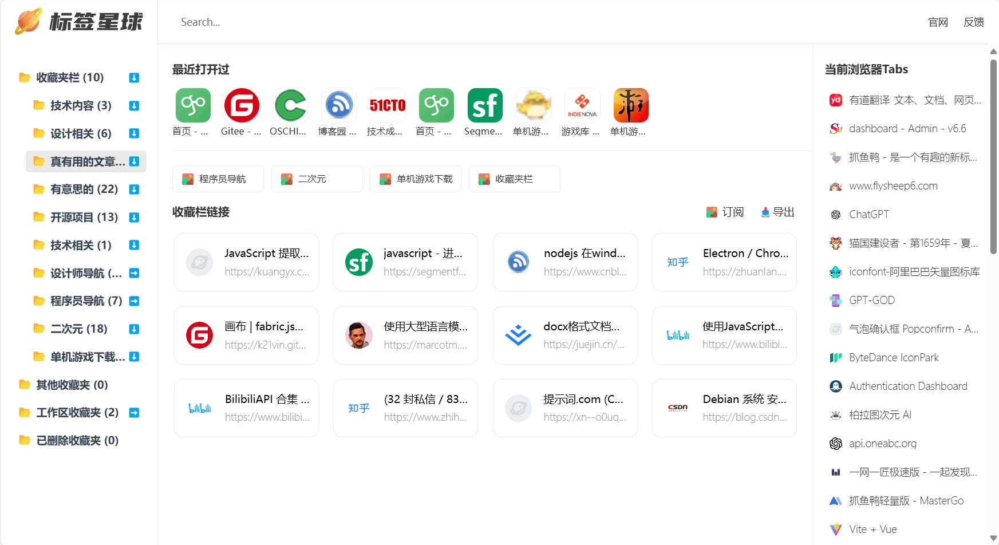
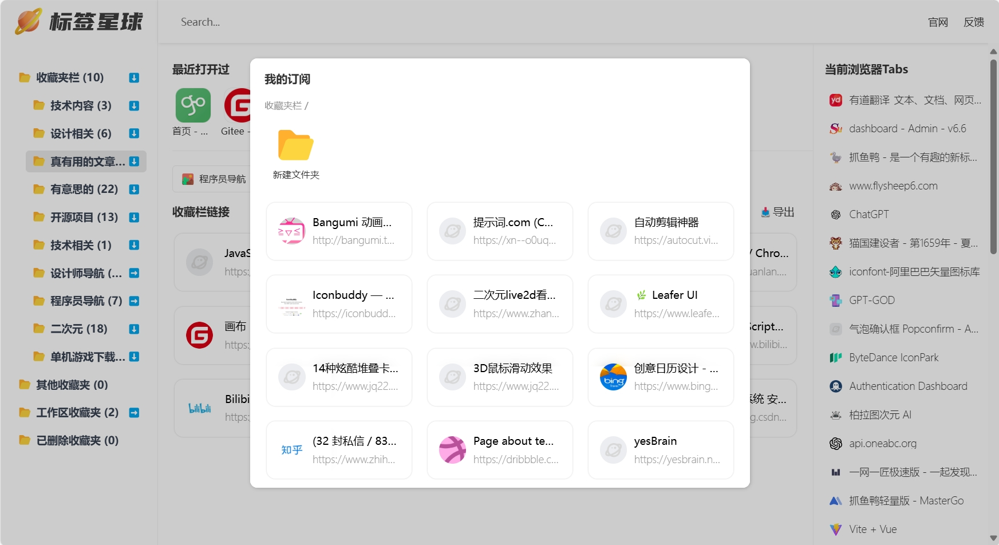
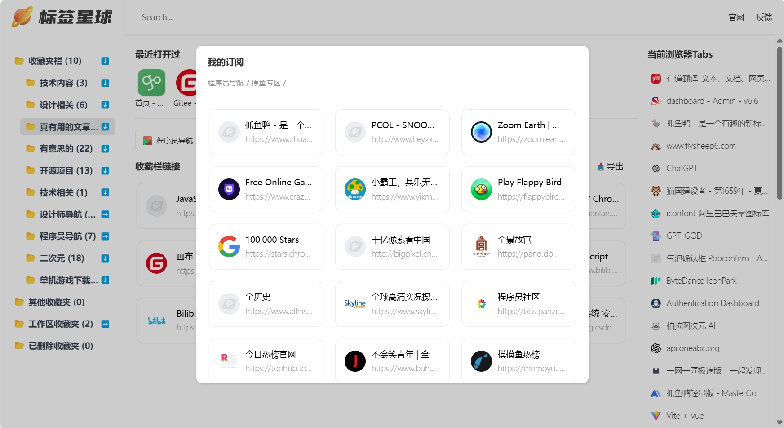
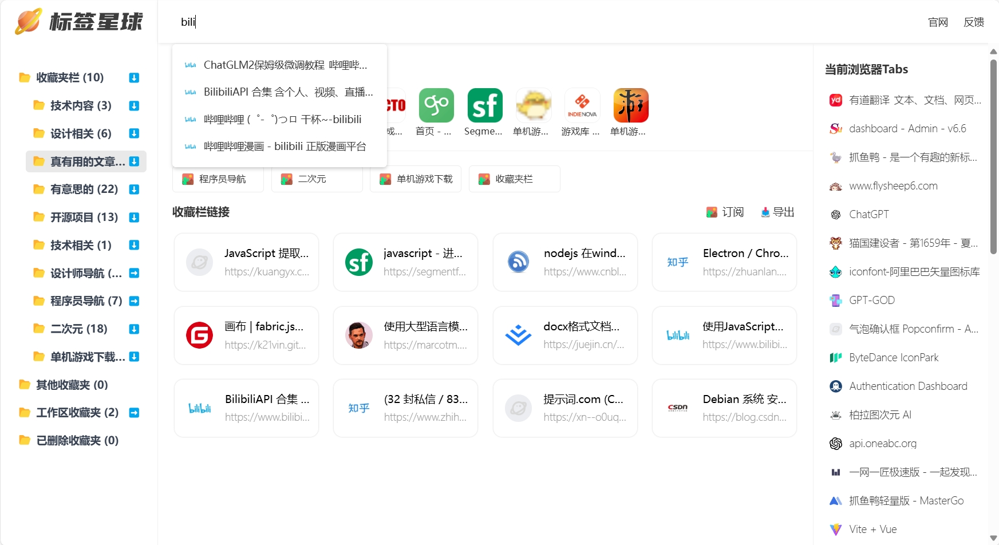
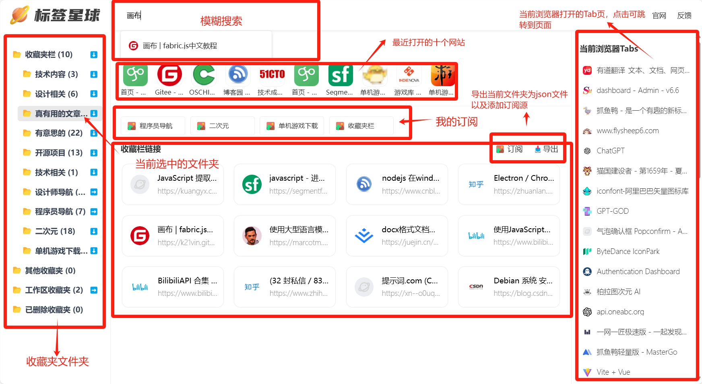

# Tag Planet - Add a Dashboard to Your Browser

[English](README.md) | [中文](README.zh.md)

Tag Planet is a browser-based tab management tool that allows you to easily manage your tabs and turn your browser into a dashboard.

# Product Features
- **Bookmark Management**: Easily manage your browser bookmarks and automatically convert them into navigation, transforming your browser into a dashboard.
- **Bookmark Fuzzy Search**: Quickly search your bookmarks by entering keywords to find the website you want.
- **Recent Visits**: Displays the 10 most recently visited websites at the top, making it easy to recover if accidentally closed.
- **Tab Bar Management**: When too many websites are open, the default tab bar can get crowded. Tag Planet uses a vertical layout, allowing direct access to tabs with a click.
- **Export Bookmarks**: Export your bookmark data to share with others.
- **Subscribe to Bookmark Sources**: Exported JSON files can be uploaded to any server as a subscription source. Users can enter the subscription source link within Tag Planet to share bookmarks.

# Support and Installation
## Support
Currently tested and fully supported only on Chrome and Edge browsers. Other browsers can be tested by yourself.
Tech Stack: `vite`   `vue3`   `crxjs`

## Installation
You can install Tag Planet through the following methods:
- **Chrome Store**: https://chromewebstore.google.com/detail/jeaebbdndojkbnnfcaihgokhnakocbnf
- **Edge Store**: https://microsoftedge.microsoft.com/addons/detail/podfjomopoejmlkfnhanlmlagcnlappd
- **Offline Installation**: https://wwo.lanzouo.com/irgle26hmucf
- **Manual Installation**: Download the code, unzip it, then enable Developer Mode in your browser’s extension settings and load the unpacked extension.
- **Note**: The latest version is v1.1. There might be a delay in the browser extension stores' review process. If the version number is not 1.1, it means it’s under review. You can use the source code to compile and install the latest version or use offline installation.

## Example Subscription Sources
You can subscribe to Tag Planet's example sources through the following links:
- **Developer Navigation**: https://file.zhuayuya.com/source/dev.json
- **Designer Navigation**: https://file.zhuayuya.com/source/design.json
- **Anime Websites**: https://file.zhuayuya.com/source/2d.json
- **Standalone Game Downloads**: https://file.zhuayuya.com/source/game.json

### Note: Subscription source requests have cross-origin issues. The source code uses the official backend proxy server by default. If you need to modify it for your own server, you can do so.

# Feedback
If you have any questions, feel free to provide feedback, and I will address them promptly.
- **Contact me via WeChat**: 1090879115
- **Email**: pony618@foxmail.com
- WeChat Official Account

# Screenshot Display

