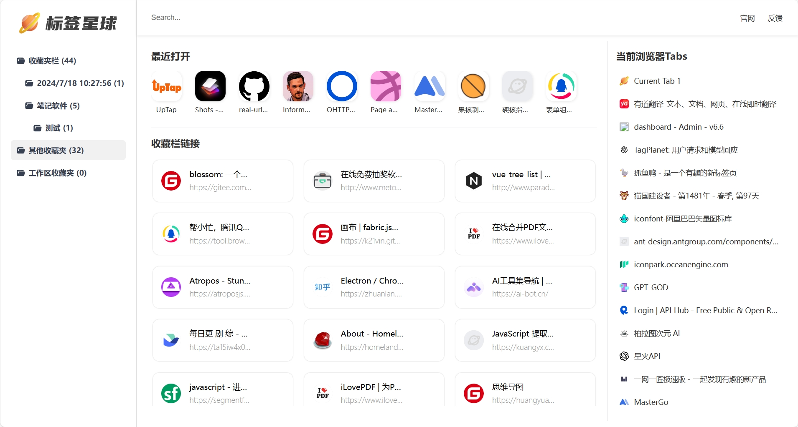

# Tag Planet - Install a Dashboard for Your Browser

[English](README.md) | [中文](README.zh.md)

Tag Planet is a browser-based tab management tool that allows you to easily manage your tabs and tag them, turning your browser into a dashboard.

# Product Features
- **Tab Management**: Easily manage your tabs and tag them, turning your browser into a dashboard.
- **Recent Visits**: Displays the last 10 websites visited at the top, so you can easily recover any tabs you accidentally closed.
- **Tab Bar Management**: If you have too many websites open in your browser, the default tab bar can get too crowded. Tag Planet uses a vertical layout, allowing you to click directly to jump to a tab.

# Support and Installation
## Support
Currently, only Chrome and Edge browsers have been tested for perfect compatibility. Other browsers can be tested at your own discretion.

## Installation
You can install Tag Planet through the following methods:
- Download the installer package: https://wwo.lanzouo.com/i0lD224yl0yb
- Manual installation: Download the code, unzip it, and open the Developer mode in the browser's extension settings, then load the unzipped extension.
- Chrome Web Store and Edge Add-ons Store are under review and will be released soon.

# Feedback
If you have any questions, feel free to reach out to me, and I will handle them promptly.
- You can contact me via WeChat: 1090879115
- Email: pony618@foxmail.com
- WeChat Group & Official Account

