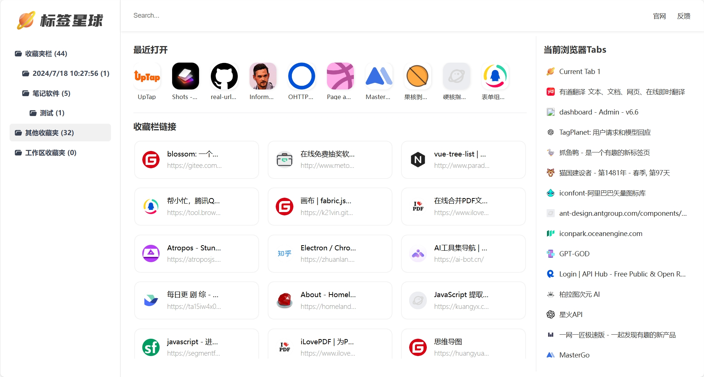

# 标签星球-给你的浏览器装个仪表盘

[English](README.md) | [中文](README.zh.md)

标签星球是一个基于浏览器的标签管理工具，你可以轻松的管理你的标签，并给它们打上标签，让你的浏览器成为一个仪表盘。

# 产品功能
- **标签管理**：你可以轻松的管理你的浏览器收藏夹，将收藏数据自动转为导航，让你的浏览器成为一个仪表盘。
- **最近访问**：最上方显示最近访问的10个网站，不小心误关，轻松找回
- **Tab栏管理**：浏览器打开太多网站，默认Tab栏太拥挤，标签星球竖向布局，点击直接跳到Tab

# 支持和安装
## 支持
目前仅测试了chrome、edge两款浏览器可以完美支持，其他浏览器可以自行测试。

## 安装
你可以通过以下方式安装标签星球：
- **Chrome商城**：https://chromewebstore.google.com/detail/jeaebbdndojkbnnfcaihgokhnakocbnf
- **Edge商城**：https://microsoftedge.microsoft.com/addons/detail/podfjomopoejmlkfnhanlmlagcnlappd
- **下载安装包**：https://wwo.lanzouo.com/i0lD224yl0yb
- **手动安装**：下载代码，解压后，在浏览器扩展程序中打开开发者模式，加载已解压的扩展程序。
- chrome商城和edge商城还在审核中，稍后会发布到商城。

# 反馈
如果你有任何问题，欢迎反馈给我，我会及时处理。
- **可以通过微信联系我**：1090879115
- **Email**：pony618@foxmail.com
- 微信群 & 公众号

