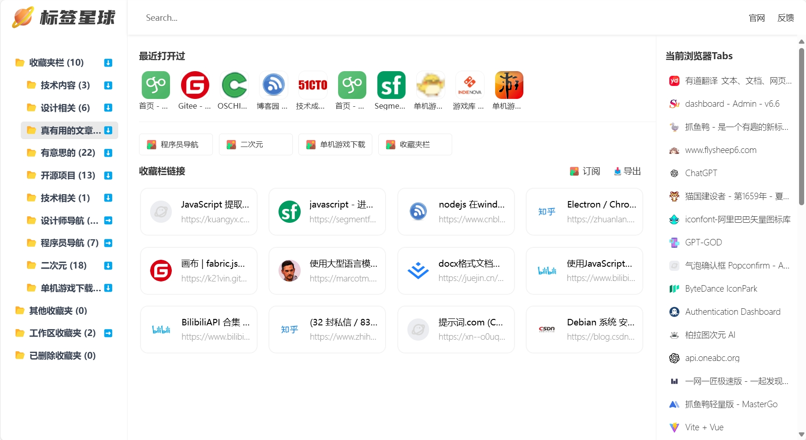
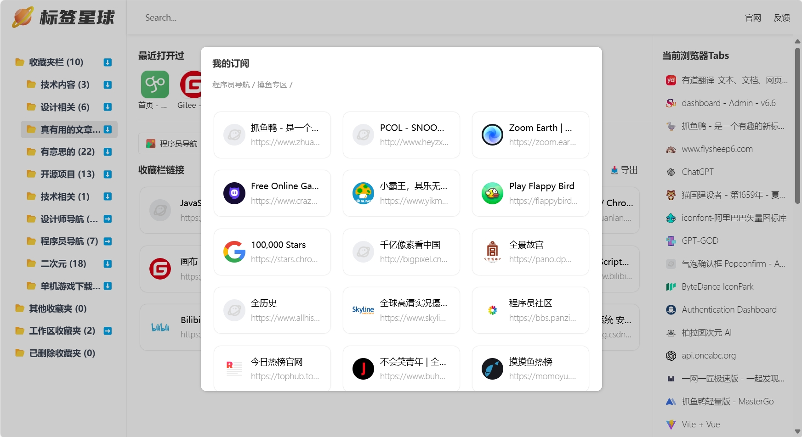

# 标签星球-给你的浏览器装个仪表盘

[English](README.md) | [中文](README.zh.md)

标签星球是一个基于浏览器的标签管理工具，你可以轻松的管理你的标签页，让你的浏览器成为一个仪表盘。

# 产品功能
- **收藏夹管理**：你可以轻松的管理你的浏览器收藏夹，将收藏数据自动转为导航，让你的浏览器成为一个仪表盘。
- **收藏夹模糊搜索**：输入关键字快速搜索你的收藏夹，快速找到你想要的网站。
- **最近访问**：最上方显示最近访问的10个网站，不小心误关，轻松找回。
- **Tab栏管理**：浏览器打开太多网站，默认Tab栏太拥挤，标签星球竖向布局，点击直接跳到Tab。
- **导出收藏夹**：导出你的收藏夹数据，分享给他人。
- **订阅收藏源**：导出的json文件可以上传至任意服务器作为订阅源，用户可在标签星球内输入订阅源链接，实现收藏夹分享。

# 支持和安装
## 支持
目前仅测试了chrome、edge两款浏览器可以完美支持，其他浏览器可以自行测试。
技术栈：`vite`   `vue3`   `crxjs`

## 安装
你可以通过以下方式安装标签星球：
- **Chrome商店**：https://chromewebstore.google.com/detail/jeaebbdndojkbnnfcaihgokhnakocbnf
- **Edge商店**：https://microsoftedge.microsoft.com/addons/detail/podfjomopoejmlkfnhanlmlagcnlappd
- **离线安装**：https://wwo.lanzouo.com/irgle26hmucf
- **手动安装**：下载代码，解压后，在浏览器扩展程序中打开开发者模式，加载已解压的扩展程序。
- **注意**：目前最新版本v1.1，浏览器扩展商店有审核延迟，如果版本号不是1.1就是审核中体验最新版本可用源码编译安装或离线安装

## 示例订阅源
你可以通过以下链接订阅标签星球的示例订阅源：
- **开发者导航**：https://file.zhuayuya.com/source/dev.json
- **设计师导航**：https://file.zhuayuya.com/source/design.json
- **二次元网站**：https://file.zhuayuya.com/source/2d.json
- **单机游戏下载**：https://file.zhuayuya.com/source/game.json

### 注意：订阅源请求有跨域问题，源代码默认使用了官方后端中转服务器，需要二开可以自行修改成自己的

# 反馈
如果你有任何问题，欢迎反馈给我，我会及时处理。
- **可以通过微信联系我**：1090879115
- **Email**：pony618@foxmail.com
- 公众号

# 截图展示

